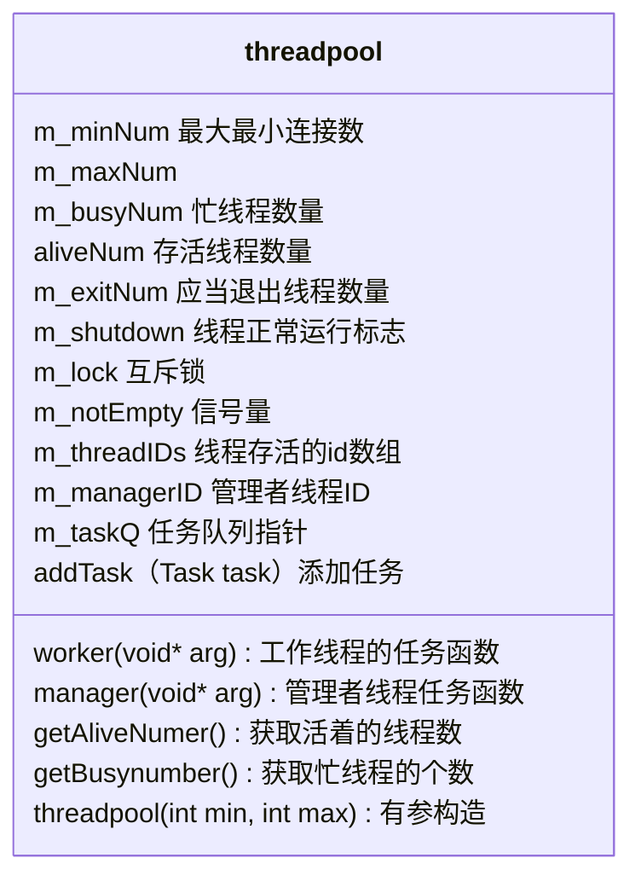

#使用C++实现线程池

##线程池

###任务队列
将所有的任务添加在一个队列中，一个任务就相当于是一个函数，任务类就相当是一个抽象的函数。

####线程池

```mermaid
classDiagram
  class threadpool
  threadpool : m_minNum 最大最小连接数
  threadpool : m_maxNum
  threadpool : m_busyNum 忙线程数量
  threadpool : aliveNum 存活线程数量
  threadpool : m_exitNum 应当退出线程数量
  threadpool : m_shutdown 线程正常运行标志
  threadpool : m_lock 互斥锁
  threadpool : m_notEmpty 信号量
  threadpool : m_threadIDs 线程存活的id数组
  threadpool : m_managerID 管理者线程ID
  threadpool : m_taskQ 任务队列指针
  threadpool : worker(void* arg) 工作线程的任务函数
  threadpool : manager(void* arg) 管理者线程任务函数
  threadpool : getAliveNumer() 获取活着的线程数
  threadpool : getBusynumber() 获取忙线程的个数
  threadpool : addTask（Task task）添加任务
  threadpool : threadpool(int min, int max) 有参构造 
  
```

###管理者线程 
管理线程池中存活线程的数量（创建线程、销毁线程）

### 工作者线程
从任务队列中拿取任务到自己的线程中运行

